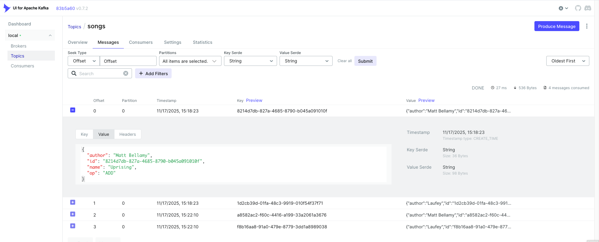
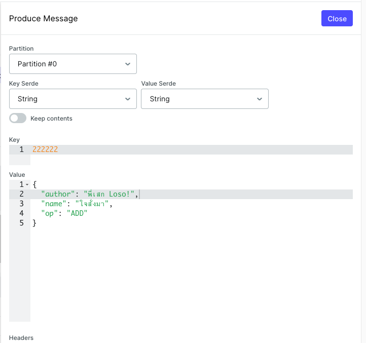

# Kafka Demo on Containers
- [Kafka Demo on Containers](#kafka-demo-on-containers)
  - [Prerequisites](#prerequisites)
  - [Kafka](#kafka)
  - [Test Applications](#test-applications)
    - [Producer](#producer)
    - [Consumer](#consumer)
  - [Kafka-UI](#kafka-ui)

## Prerequisites
- Docker and docker-compose or Podman and podman-compose
- OpenJDK 21 and maven 3.9.x for run testing applications
- curl
  
## Kafka
Configuration

| Component  | Container Port | Host Port |
|------------|----------------|-----------|
| zookeeper1 | 2181           | 22181     |
| broker1    | 9092           | 29092     |
| broker2    | 9093           | 29093     |
| broker3    | 9094           | 29094     |
| kafka-ui   | 8080           | 8085      |

- run following commands
  
```bash
cd setup
docker-compose up -d
```

Sample output

```bash
ae1a5e7f1e6f62cc4d62293a5d6dfbe70b371459b2885bcaaa627353e0c233f5
62a1904dfdebee6e86bfc105a1f68449b6d89b979770ef2195ef73d2a35bd72c
e6e12a352708378b394fc188b695f2e524f1bbb44a61c70405e6c8c571736a21
ee23591108234b01e5efc76b9de6aac4c63102f6a0fb5ed1f9513b73bb63c02f
92b9b38ccff76ab6f849238a22addf3d2a8f6b716734bf2210e5abcfa0c7cddb
21957ec8f0d0eb8e281159b4e841b8ba9a062edcb172c81caeca09984d7ff676
setup_zookeeper1_1
setup_kafka1_1
setup_kafka2_1
setup_kafka3_1
setup_kafka-ui_1
```

Check log

```bash
docker-compose logs kafka1
```

Sample output

```log
[2025-11-17 08:15:00,132] INFO [SocketServer listenerType=ZK_BROKER, nodeId=1] Enabling request processing. (kafka.network.SocketServer)
[2025-11-17 08:15:00,151] INFO Kafka version: 7.4.4-ccs (org.apache.kafka.common.utils.AppInfoParser)
[2025-11-17 08:15:00,151] INFO Kafka commitId: 9fe9275fbd13966fe9e3ed8a9619cc0513f5f546 (org.apache.kafka.common.utils.AppInfoParser)
[2025-11-17 08:15:00,151] INFO Kafka startTimeMs: 1763367300138 (org.apache.kafka.common.utils.AppInfoParser)
[2025-11-17 08:15:00,155] INFO [KafkaServer id=1] started (kafka.server.KafkaServer)
[2025-11-17 08:15:00,267] INFO [BrokerToControllerChannelManager broker=1 name=forwarding]: Recorded new controller, from now on will use node kafka3:9094 (id: 3 rack: null) (kafka.server.BrokerToControllerRequestThread)
[2025-11-17 08:15:00,293] INFO [BrokerToControllerChannelManager broker=1 name=alterPartition]: Recorded new controller, from now on will use node kafka3:9094 (id: 3 rack: null) (kafka.server.BrokerToControllerRequestThread)
```

## Test Applications
### Producer
- Build song-app with maven

```bash
cd apps/song-app
mvn clean package -DskipTests=true
```

- Run app

```bash
java \
-Dmp.messaging.outgoing.songs.bootstrap.servers=localhost:29092,localhost:29093,localhost:29094 \
-jar target/quarkus-app/quarkus-run.jar
```

Sample output

```log
15:17:18 INFO  traceId=, parentId=, spanId=, sampled= [io.sm.re.me.kafka] (smallrye-kafka-producer-thread-0) SRMSG18258: Kafka producer kafka-producer-songs, connected to Kafka brokers 'localhost:29092,localhost:29093,localhost:29094', is configured to write records to 'songs'
15:17:19 INFO  traceId=, parentId=, spanId=, sampled= [io.quarkus] (main) song-app 1.0.0-SNAPSHOT on JVM (powered by Quarkus 3.0.3.Final) started in 0.698s. Listening on: http://0.0.0.0:8080
15:17:19 INFO  traceId=, parentId=, spanId=, sampled= [io.quarkus] (main) Profile prod activated.
15:17:19 INFO  traceId=, parentId=, spanId=, sampled= [io.quarkus] (main) Installed features: [cdi, kafka-client, micrometer, resteasy, resteasy-jsonb, smallrye-context-propagation, smallrye-health, smallrye-openapi, smallrye-reactive-messaging, smallrye-reactive-messaging-kafka, vertx]
```

- Run following command to send messages to topic name songs

```bash
curl -v -X POST -H "Content-Type: application/json" -d @data/uprising.json http://localhost:8080/songs
curl -v -X POST -H "Content-Type: application/json" -d @data/from-the-start.json http://localhost:8080/songs
```

Sample output

```log
15:18:23 INFO  traceId=, parentId=, spanId=, sampled= [or.ac.so.ap.SongResource] (executor-thread-1) song: 8214d7db-827a-4685-8790-b045a091010f, Name: Uprising
15:18:23 INFO  traceId=, parentId=, spanId=, sampled= [or.ac.so.ap.SongResource] (executor-thread-1) song: 1d2cb39d-01fa-48c3-9919-010f54f37f71, Name: From The Start
```

### Consumer

- Build song-app with maven

```bash
cd apps/song-indexder
mvn clean package -DskipTests=true
```

- Run app

```bash
java \
-Dmp.messaging.incoming.songs.bootstrap.servers=localhost:29092,localhost:29093,localhost:29094 \
-Dquarkus.http.port=8081 \
-jar target/quarkus-app/quarkus-run.jar
```
Sample output

```log
15:20:19 INFO  traceId=, parentId=, spanId=, sampled= [io.sm.re.me.kafka] (main) SRMSG18229: Configured topics for channel 'songs': [songs]
15:20:19 INFO  traceId=, parentId=, spanId=, sampled= [io.sm.re.me.kafka] (smallrye-kafka-consumer-thread-0) SRMSG18257: Kafka consumer kafka-consumer-songs, connected to Kafka brokers 'localhost:29092,localhost:29093,localhost:29094', belongs to the 'songs' consumer group and is configured to poll records from [songs]
15:20:19 INFO  traceId=, parentId=, spanId=, sampled= [io.quarkus] (main) song-indexer-app  1.0.0-SNAPSHOT on JVM (powered by Quarkus 3.0.3.Final) started in 0.668s. Listening on: http://0.0.0.0:8081
15:20:19 INFO  traceId=, parentId=, spanId=, sampled= [io.quarkus] (main) Profile prod activated.
15:20:19 INFO  traceId=, parentId=, spanId=, sampled= [io.quarkus] (main) Installed features: [cdi, kafka-client, micrometer, resteasy-jsonb, smallrye-context-propagation, smallrye-health, smallrye-reactive-messaging, smallrye-reactive-messaging-kafka, vertx]
15:20:24 INFO  traceId=, parentId=, spanId=, sampled= [io.sm.re.me.kafka] (vert.x-eventloop-thread-8) SRMSG18256: Initialize record store for topic-partition 'songs-0' at position -1.
15:20:24 INFO  traceId=, parentId=, spanId=, sampled= [or.ac.so.in.ap.SongResource] (vert.x-eventloop-thread-8) Key: 8214d7db-827a-4685-8790-b045a091010f, Payload: {"author":"Matt Bellamy","id":"8214d7db-827a-4685-8790-b045a091010f","name":"Uprising","op":"ADD"}, Metadata: 2025-11-17T08:18:23.915Z
15:20:24 INFO  traceId=, parentId=, spanId=, sampled= [or.ac.so.in.ap.SongResource] (vert.x-eventloop-thread-8) Key: 1d2cb39d-01fa-48c3-9919-010f54f37f71, Payload: {"author":"Laufey","id":"1d2cb39d-01fa-48c3-9919-010f54f37f71","name":"From The Start","op":"ADD"}, Metadata: 2025-11-17T08:18:23.920Z
```

- Check that consumer read 2 JSON documents from topic name songs

```log
15:20:24 INFO  traceId=, parentId=, spanId=, sampled= [or.ac.so.in.ap.SongResource] (vert.x-eventloop-thread-8) Key: 8214d7db-827a-4685-8790-b045a091010f, Payload: {"author":"Matt Bellamy","id":"8214d7db-827a-4685-8790-b045a091010f","name":"Uprising","op":"ADD"}, Metadata: 2025-11-17T08:18:23.915Z
15:20:24 INFO  traceId=, parentId=, spanId=, sampled= [or.ac.so.in.ap.SongResource] (vert.x-eventloop-thread-8) Key: 1d2cb39d-01fa-48c3-9919-010f54f37f71, Payload: {"author":"Laufey","id":"1d2cb39d-01fa-48c3-9919-010f54f37f71","name":"From The Start","op":"ADD"}, Metadata: 2025-11-17T08:18:23.920Z
```
## Kafka-UI

- Use browser and connect to http://localhost:8085
- Check message in topic song
 


- Produce message with Kafka-UI



